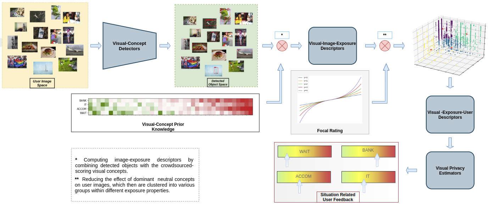

# LERVUP: LEarning to Rate Visual User Profiles 
Official repository. 

## Paper




Unveiling Real-Life Effects of Online Photo Sharing \[[arXiv](https://arxiv.org/abs/2012.13180)\]

If you find our work useful, please cite:
```
@article{nguyen2020unveiling,
  title={Unveiling Real-Life Effects of Online Photo Sharing},
  author={Nguyen, Van-Khoa and Popescu, Adrian and Deshayes-Chossart, Jerome},
  journal={arXiv preprint arXiv:2012.13180},
  year={2020}
}
```

## Preparation

The repository contains training and inference code of various algorithms for learning and evaluating its performance on our proposed dataset. The dataset, including images that are shared publicly under Creative Commons linenses, was annotated throughout crowdsourcing and was then pre-prococessed. More details about the dataset can be found in the paper descriptions.

### Environment setup

We use the package-management software annaconda for experiences. For installing and activating the environment, please follow the below steps:

```
conda env create -f requirements.yml
conda activate lervup
```

### Pre-trained model download
We realease pre-trained models corresponding to the algorithms described in the paper. These models were fine-tuned on different hyper-parameter configurations. The best ones are chosen. To download and setup the pretrained model folder, please run the following script.

```
sh download.sh
```

## Training

We divide the algorithms into separate packages. Below is the main structure:

```
lervup_offical
  ....
  base_algo
    ....
    base
      ....
    base_opt
      ....
  base_fr_algo
    ....
  lervup_algo
    ....
```
- The `base_algo` package contains two baselines:
  - `base` is the utmost baseline, which selects only an optimal threshold for all objects (visual concepts).
  -  `base_opt` is the optimal baseline, which calculates an optimal threshold per object and performs  active detector selection. 
- The `base_fr_algo` package is the optimal baseline (`base_opt`) with use of focal rating.
- The `lervup_algo` package is the principal algorithm descriped in the paper. In this package, we include also code for the abalation study of regression on aggregated features in the `agg_feat_regressor.py` module. 

In all packages except for `base_algo`, we provide code for customizing training experience. For instance, to run a default training process in the `lervup_algo` package:

```
python train_test_lervup.py --config_file ./configs/rcnn_rf_kmeans.yaml --model_name rcnn_wait.pkl --situation WAIT --verbose True
```

To fine-tune other hyper-parameters:

```
python3 train_test_lervup.py --config_file ./configs/rf_kmeans_ft_mobi_cv5.yaml --model_name it_mobi.pkl --situation IT --N 200 --opts FE.MODE OBJECT  FE.K 10  FE.GAMMA 2  DETECTOR.LOAD True SOLVER.PFT ORG OUTPUT.DIR ./mobinet_models/

```
For more details about hyper-parameters, please consult in `configs`, `base_fr_algo/lib/config`, and `lervup_algo/vispel/config` modules of the packages. The experiences on `base_algo` and  `agg_feat_regressor.py` are invoked in the `inference` below section.

## Inference

In all packages except for `base_algo`, we provide code snippets for reproducing a trained-model result and showing the model's configuration. For instance, to run inference in the `lervup_algo` package.

```
python test_lervup.py --model_path ./mobinet_models/it_mobi.pkl --print 1

```
We also provide a module `runner.py` for reproducing the results of the pretrained-models, the results in the `base_algo` package, and the ones in the  `agg_feat_regressor.py` module. To run it:

```
python runner.py --method base

```

- `base`: the utmost baseline algorithm.
- `base_opt`: the baseline with optimal threshold per object and active detector selection.
- `base_fr`: the optimal baseline with use of focal rating.
- `regress`: raw feature or PCA-reduced feature regression.
- `lervup_nofr`: lervup without the focal rating impact.
- `lervup_fr`: lervup + focal rating.
- `lervup_halfuser`: lervup using only a half of training users.
- `lervup_haflobj`: lervup using only a half of visual concepts.